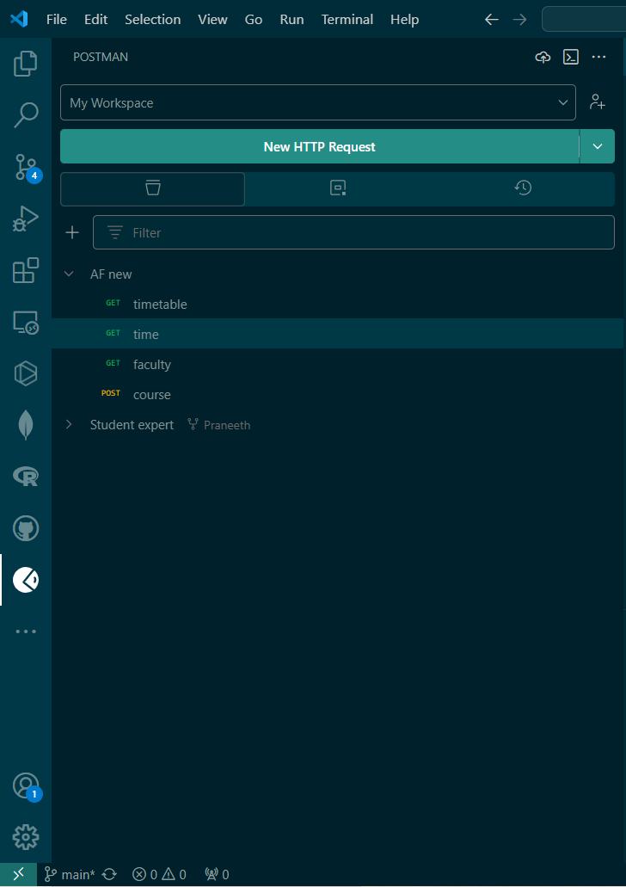
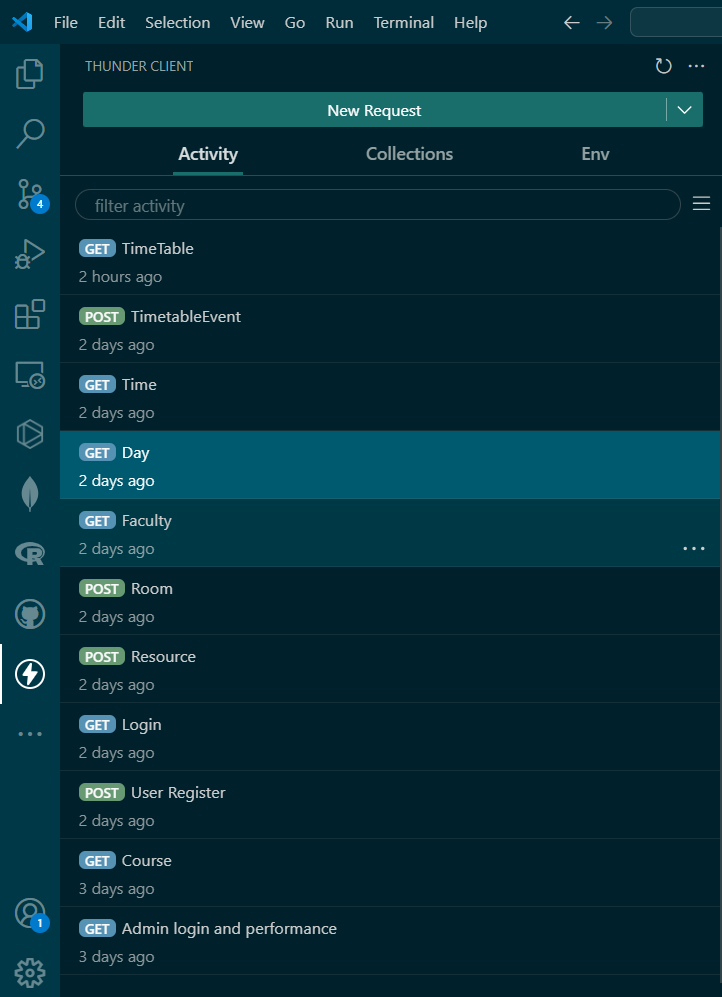

[](https://classroom.github.com/a/MhkFIDKy)

# Dilshan.O.A.P. <br> IT21302480

## 1. API endpoint documentation. <br> 2. How to run Tests.

### 1. API Documentation

```markdown     
|                 API End Point                                       |    Function              |
|---------------------------------------------------------------------|--------------------------|
| http://localhost:8001/api/v1/user/register                          |   User Register          |
| http://localhost:8001/api/v1/user/login                             |   User Login             |
| http://localhost:8001/api/v1/user/profile                           |   GetUserProfile         |
| http://localhost:8001/api/v1/user/updateUser                        |   UpdateUsersProfile     |
| http://localhost:8001/api/v1/user/getAllUser                        |   GetAllUsers            |
| http://localhost:8001/api/v1/user//updateUser/:userId               |   UpdateUserProfile      |
        
| http://localhost:8001/api/v1/course/create                          |   Create Course          |
| http://localhost:8001/api/v1/course/getAllCourse                    |   Get All Course         |
| http://localhost:8001/api/v1/course/getOneCourse/:courseId          |   Get One Course         |
| http://localhost:8001/api/v1/course/updateCourse/:courseId          |   Update Course          |
| http://localhost:8001/api/v1/course/deleteCourse/:courseId          |   Delete Course          |
        
| http://localhost:8001/api/v1/day/create                             |   Create Day             |
| http://localhost:8001/api/v1/day/getAllCourse                       |   Get All Day            |
| http://localhost:8001/api/v1/day/getOneCourse/:courseId             |   Get One Day            |
| http://localhost:8001/api/v1/day/updateCourse/:courseId             |   Update Day             |
| http://localhost:8001/api/v1/day/deleteCourse/:courseId             |   Delete Day             |
            
| http://localhost:8001/api/v1/faculty/create                         |   Create faculty         |
| http://localhost:8001/api/v1/faculty/getAllCourse                   |   Get All faculty        |
| http://localhost:8001/api/v1/faculty/getOneCourse/:courseId         |   Get One faculty        |
| http://localhost:8001/api/v1/faculty/updateCourse/:courseId         |   Update faculty         |
| http://localhost:8001/api/v1/faculty/deleteCourse/:courseId         |   Delete faculty         |
        
| http://localhost:8001/api/v1/resource/create                        |   Create resource        |
| http://localhost:8001/api/v1/resource/getAllCourse                  |   Get All resource       |
| http://localhost:8001/api/v1/resource/getOneCourse/:courseId        |   Get One resource       |
| http://localhost:8001/api/v1/resource/updateCourse/:courseId        |   Update resource        |
| http://localhost:8001/api/v1/resource/deleteCourse/:courseId        |   Delete resource        |
        
| http://localhost:8001/api/v1/room/create                            |   Create room            |
| http://localhost:8001/api/v1/room/getAllCourse                      |   Get All room           |
| http://localhost:8001/api/v1/room/getOneCourse/:courseId            |   Get One room           |
| http://localhost:8001/api/v1/room/updateCourse/:courseId            |   Update room            |
| http://localhost:8001/api/v1/room/deleteCourse/:courseId            |   Delete room            |
        
| http://localhost:8001/api/v1/time/create                            |   Create time            |
| http://localhost:8001/api/v1/time/getAllCourse                      |   Get All time           |
| http://localhost:8001/api/v1/time/getOneCourse/:courseId            |   Get One time           |
| http://localhost:8001/api/v1/time/updateCourse/:courseId            |   Update time            |
| http://localhost:8001/api/v1/time/deleteCourse/:courseId            |   Delete time            |
        
| http://localhost:8001/api/v1/timetable/create                       |   Create timetable       |
| http://localhost:8001/api/v1/timetable/getAllCourse                 |   Get All timetable      |
| http://localhost:8001/api/v1/timetable/getOneCourse/:courseId       |   Get One timetable      |
| http://localhost:8001/api/v1/timetable/updateCourse/:courseId       |   Update timetable       |
| http://localhost:8001/api/v1/timetable/deleteCourse/:courseId       |   Delete timetable       |
    
| http://localhost:8001/api/v1/timetableevent/create                  |   Create timetableevent  |
| http://localhost:8001/api/v1/timetableevent/getAllCourse            |   Get All timetableevent |
| http://localhost:8001/api/v1/timetableevent/getOneCourse/:courseId  |   Get One timetableevent |
| http://localhost:8001/api/v1/timetableevent/updateCourse/:courseId  |   Update timetableevent  |
| http://localhost:8001/api/v1/timetableevent/deleteCourse/:courseId  |   Delete timetableevent  |

```
### Steps : Start the Project
```bash
take a clone from the repo
```
```bash
create .env file (setup a mongodb cluster with a database)
```
```bash
install the packages
```
```bash
npm start (to start the project)
```

### 2. Run Tests Cases

```bash
Go to Project root directory and run command: npm update

```
```bash
Go to Project root directory and run command: npm run test

```

> Postman Testing Using Extension. (Unit)

<p align="center">
  
</p>



> Thunder Client Testing Using Extension. (Performance)

<p align="center">
  
</p>

